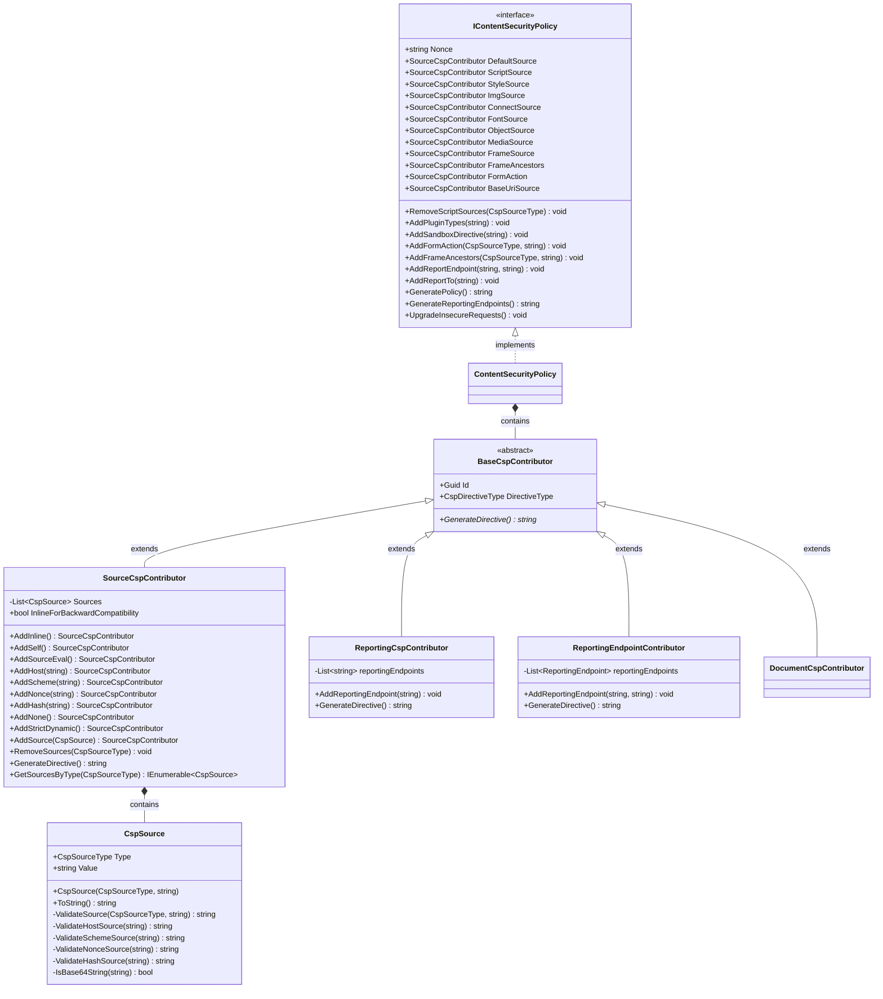

# DotNetNuke.ContentSecurityPolicy

This library provides a comprehensive Content Security Policy (CSP) implementation for DotNetNuke Platform. It offers a fluent API for building, managing, and generating CSP headers to enhance web application security by preventing various types of attacks such as Cross-Site Scripting (XSS) and data injection attacks.

## Overview

Content Security Policy (CSP) is a security standard that helps prevent cross-site scripting (XSS), clickjacking, and other code injection attacks by declaring which dynamic resources are allowed to load. This library provides a robust implementation for managing CSP directives in DotNetNuke applications.

## Core Interface: IContentSecurityPolicy

The `IContentSecurityPolicy` interface is the main entry point for managing Content Security Policy directives. It provides access to various source contributors and methods for configuring security policies.

### Key Features

- **Cryptographic Nonce Generation**: Automatically generates secure nonce values for CSP policies
- **Multiple Source Types**: Support for various CSP source types (self, inline, eval, host, scheme, nonce, hash, etc.)
- **Directive Management**: Comprehensive support for all major CSP directives
- **Fluent API**: Easy-to-use method chaining for building policies
- **Reporting**: Built-in support for CSP violation reporting

## Supported Directives

The interface provides access to the following CSP directive contributors:

### Source-based Directives
- **DefaultSource**: Fallback for other source directives (`default-src`)
- **ScriptSource**: Controls script execution (`script-src`)
- **StyleSource**: Controls stylesheet loading (`style-src`)
- **ImgSource**: Controls image sources (`img-src`)
- **ConnectSource**: Controls AJAX, WebSocket, and EventSource connections (`connect-src`)
- **FontSource**: Controls font loading (`font-src`)
- **ObjectSource**: Controls plugins and embedded objects (`object-src`)
- **MediaSource**: Controls audio and video elements (`media-src`)
- **FrameSource**: Controls iframe sources (`frame-src`)
- **FrameAncestors**: Controls embedding in frames (`frame-ancestors`)
- **FormAction**: Controls form submission targets (`form-action`)
- **BaseUriSource**: Controls base URI restrictions (`base-uri`)

### Document Directives
- **Plugin Types**: Restrict allowed plugin types
- **Sandbox**: Apply sandbox restrictions
- **Upgrade Insecure Requests**: Automatically upgrade HTTP to HTTPS

### Reporting
- **Report Endpoints**: Configure violation reporting endpoints
- **Report To**: Specify report destination

## Usage Examples

### Basic Setup

```csharp
// Create a new CSP instance
IContentSecurityPolicy csp = new ContentSecurityPolicy();

// Configure basic security policy
csp.DefaultSource.AddSelf();
csp.ScriptSource.AddSelf().AddNonce(csp.Nonce);
csp.StyleSource.AddSelf().AddInline();
csp.ImgSource.AddSelf().AddScheme("data:");
```

### Advanced Configuration

```csharp
// Configure script sources with strict security
csp.ScriptSource
    .AddSelf()
    .AddHost("cdn.example.com")
    .AddNonce(csp.Nonce)
    .AddStrictDynamic();

// Configure style sources
csp.StyleSource
    .AddSelf()
    .AddHost("fonts.googleapis.com")
    .AddHash("sha256-abc123...");

// Configure frame restrictions
csp.FrameAncestors.AddNone(); // Prevent embedding in frames

// Configure form actions
csp.AddFormAction(CspSourceType.Self, null);
csp.AddFormAction(CspSourceType.Host, "secure.example.com");
```

### Working with Nonces

```csharp
// Get the cryptographically secure nonce
string nonce = csp.Nonce;

// Use nonce in script tags
// <script nonce="@nonce">...</script>

// Nonce is automatically applied when using AddNonce()
csp.ScriptSource.AddNonce(nonce);
```

### Removing Sources

```csharp
// Remove unsafe script sources
csp.RemoveScriptSources(CspSourceType.Inline);
csp.RemoveScriptSources(CspSourceType.Eval);
```

### Reporting Configuration

```csharp
// Configure violation reporting
csp.AddReportEndpoint("default", "/api/csp-reports");
csp.AddReportTo("default");
```

### Generating Policy Headers

```csharp
// Generate the complete CSP header value
string cspHeader = csp.GeneratePolicy();
// Result: "default-src 'self'; script-src 'self' 'nonce-abc123'; style-src 'self' 'unsafe-inline'"

// Generate reporting endpoints header
string reportingHeader = csp.GenerateReportingEndpoints();
```

## Source Types

The library supports all standard CSP source types through the `CspSourceType` enumeration:

- **Host**: Specific domains (e.g., `example.com`, `*.example.com`)
- **Scheme**: Protocol schemes (e.g., `https:`, `data:`, `blob:`)
- **Self**: Same origin (`'self'`)
- **Inline**: Inline scripts/styles (`'unsafe-inline'`)
- **Eval**: Dynamic code evaluation (`'unsafe-eval'`)
- **Nonce**: Cryptographic nonce (`'nonce-abc123'`)
- **Hash**: Cryptographic hash (`'sha256-abc123'`)
- **None**: Block all sources (`'none'`)
- **StrictDynamic**: Enable strict dynamic loading (`'strict-dynamic'`)

## Security Best Practices

1. **Avoid `'unsafe-inline'`**: Use nonces or hashes instead
2. **Avoid `'unsafe-eval'`**: Prevents code injection attacks
3. **Use `'strict-dynamic'`**: For modern browsers with script loading
4. **Implement reporting**: Monitor CSP violations
5. **Start restrictive**: Begin with strict policies and relax as needed
6. **Test thoroughly**: Ensure all legitimate resources load correctly

## Implementation Details

### Key Classes

- **ContentSecurityPolicy**: Main implementation of `IContentSecurityPolicy`
- **SourceCspContributor**: Manages source-based directives
- **CspSource**: Represents individual CSP sources
- **CspDirectiveType**: Enumeration of all CSP directive types
- **CspSourceType**: Enumeration of all CSP source types

### Thread Safety

The CSP implementation is designed to be used within a single request context. For multi-threaded scenarios, create separate instances per thread or request.

### Performance Considerations

- Nonce generation uses cryptographically secure random number generation
- Policy generation is optimized for minimal string operations
- Source deduplication prevents duplicate entries

## Class Diagram



## Integration with DotNetNuke

This library integrates seamlessly with the DotNetNuke Platform's security infrastructure and can be used within:

- Custom modules
- Skin implementations
- HTTP modules and handlers
- API controllers
- Page rendering pipelines

