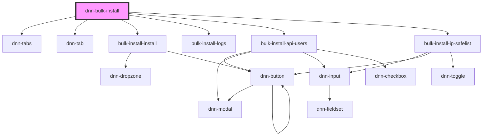

# my-component

<!-- Auto Generated Below -->

## Properties

| Property                | Attribute   | Description | Type     | Default     |
| ----------------------- | ----------- | ----------- | -------- | ----------- |
| `moduleId` _(required)_ | `module-id` |             | `number` | `undefined` |

## Dependencies

### Depends on

- dnn-tabs
- dnn-tab
- [bulk-install-install](../tabs/bulk-install-install)
- [bulk-install-logs](../tabs/bulk-install-logs)
- [bulk-install-api-users](../tabs/bulk-install-api-users)
- [bulk-install-ip-safelist](../tabs/bulk-install-ip-safelist)

### Graph

----------------------------------------------

*Built with [StencilJS](https://stenciljs.com/)*
