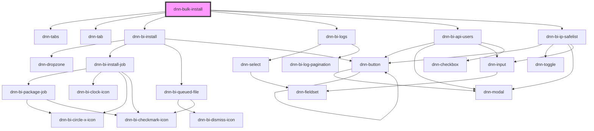

# my-component

<!-- Auto Generated Below -->

## Properties

| Property                | Attribute   | Description           | Type     | Default     |
| ----------------------- | ----------- | --------------------- | -------- | ----------- |
| `moduleId` _(required)_ | `module-id` | The ID of the module. | `number` | `undefined` |

## Dependencies

### Depends on

- dnn-tabs
- dnn-tab
- [dnn-bi-install](../tabs/dnn-bi-install)
- [dnn-bi-logs](../tabs/dnn-bi-logs)
- [dnn-bi-api-users](../tabs/dnn-bi-api-users)
- [dnn-bi-ip-safelist](../tabs/dnn-bi-ip-safelist)

### Graph

```mermaid
graph TD;
  dnn-bulk-install --> dnn-tabs
  dnn-bulk-install --> dnn-tab
  dnn-bulk-install --> dnn-bi-install
  dnn-bulk-install --> dnn-bi-logs
  dnn-bulk-install --> dnn-bi-api-users
  dnn-bulk-install --> dnn-bi-ip-safelist
  dnn-bi-install --> dnn-dropzone
  dnn-bi-install --> dnn-bi-install-job
  dnn-bi-install --> dnn-bi-queued-file
  dnn-bi-install --> dnn-button
  dnn-bi-install-job --> dnn-bi-package-job
  dnn-bi-install-job --> dnn-bi-clock-icon
  dnn-bi-install-job --> dnn-bi-circle-x-icon
  dnn-bi-install-job --> dnn-bi-checkmark-icon
  dnn-bi-package-job --> dnn-bi-circle-x-icon
  dnn-bi-package-job --> dnn-bi-checkmark-icon
  dnn-bi-queued-file --> dnn-bi-dismiss-icon
  dnn-bi-queued-file --> dnn-bi-checkmark-icon
  dnn-button --> dnn-modal
  dnn-button --> dnn-button
  dnn-bi-logs --> dnn-select
  dnn-bi-logs --> dnn-bi-log-pagination
  dnn-select --> dnn-fieldset
  dnn-bi-api-users --> dnn-button
  dnn-bi-api-users --> dnn-modal
  dnn-bi-api-users --> dnn-input
  dnn-bi-api-users --> dnn-checkbox
  dnn-input --> dnn-fieldset
  dnn-bi-ip-safelist --> dnn-button
  dnn-bi-ip-safelist --> dnn-toggle
  dnn-bi-ip-safelist --> dnn-modal
  dnn-bi-ip-safelist --> dnn-input
  style dnn-bulk-install fill:#f9f,stroke:#333,stroke-width:4px
```

----------------------------------------------

*Built with [StencilJS](https://stenciljs.com/)*
