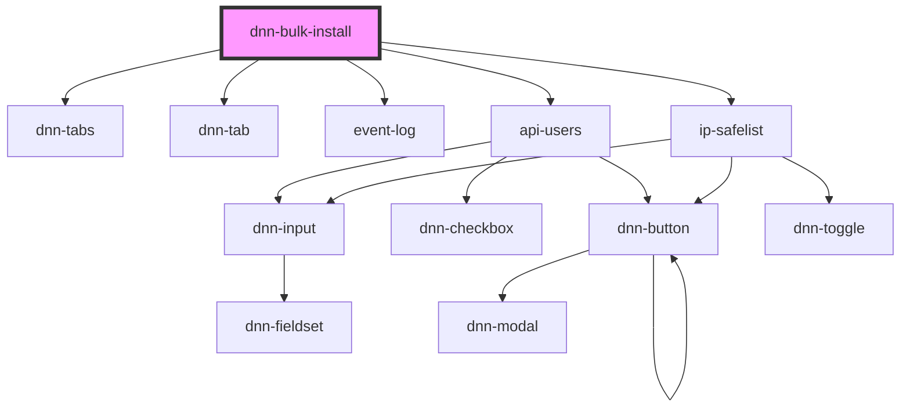

# my-component

<!-- Auto Generated Below -->

## Dependencies

### Depends on

- dnn-tabs
- dnn-tab
- [event-log](../tabs/event-log)
- [api-users](../tabs/api-users)
- [ip-safelist](../tabs/ip-safelist)

### Graph

----------------------------------------------

*Built with [StencilJS](https://stenciljs.com/)*
