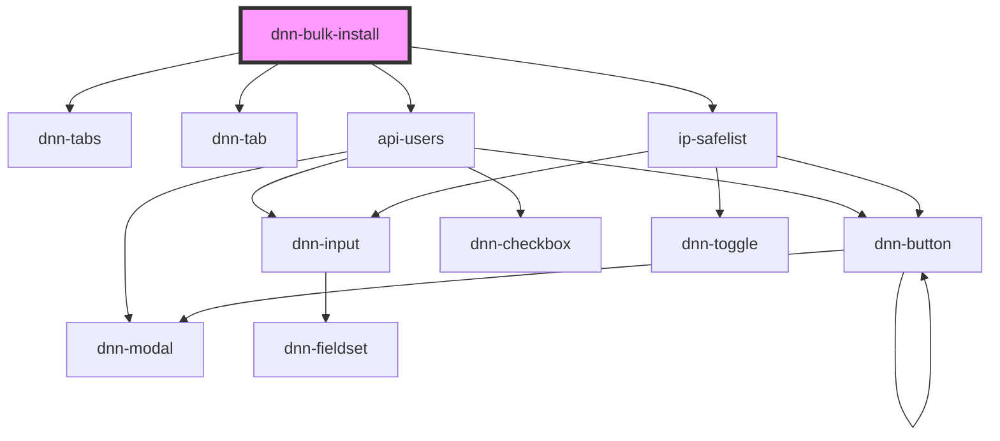

# my-component

<!-- Auto Generated Below -->

## Dependencies

### Depends on

- dnn-tabs
- dnn-tab
- [api-users](../api-users)
- [ip-safelist](../ip-safelist)

### Graph

----------------------------------------------

*Built with [StencilJS](https://stenciljs.com/)*
