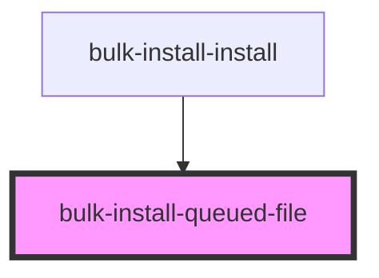

# bulk-install-queued-file

<!-- Auto Generated Below -->

## Properties

| Property                         | Attribute              | Description                          | Type      | Default     |
| -------------------------------- | ---------------------- | ------------------------------------ | --------- | ----------- |
| `file` _(required)_              | --                     | The file to upload.                  | `File`    | `undefined` |
| `maxUploadFileSize` _(required)_ | `max-upload-file-size` | The maximal allowed file upload size | `number`  | `undefined` |
| `session` _(required)_           | --                     | The current session.                 | `Session` | `undefined` |

## Dependencies

### Used by

 - [bulk-install-install](..)

### Graph

----------------------------------------------

*Built with [StencilJS](https://stenciljs.com/)*
