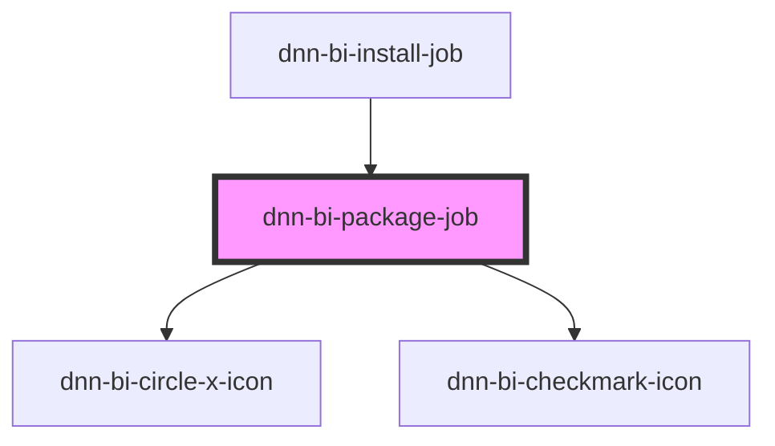

# bulk-install-queued-file

<!-- Auto Generated Below -->

## Properties

| Property                 | Attribute   | Description                             | Type         | Default     |
| ------------------------ | ----------- | --------------------------------------- | ------------ | ----------- |
| `attempted` _(required)_ | `attempted` | Whether the installation was completed. | `boolean`    | `undefined` |
| `job` _(required)_       | --          | The package job.                        | `PackageJob` | `undefined` |

## Dependencies

### Used by

 - [dnn-bi-install-job](../dnn-bi-install-job)

### Depends on

- [dnn-bi-circle-x-icon](../../../icons/dnn-bi-circle-x-icon)
- [dnn-bi-checkmark-icon](../../../icons/dnn-bi-checkmark-icon)

### Graph

----------------------------------------------

*Built with [StencilJS](https://stenciljs.com/)*
