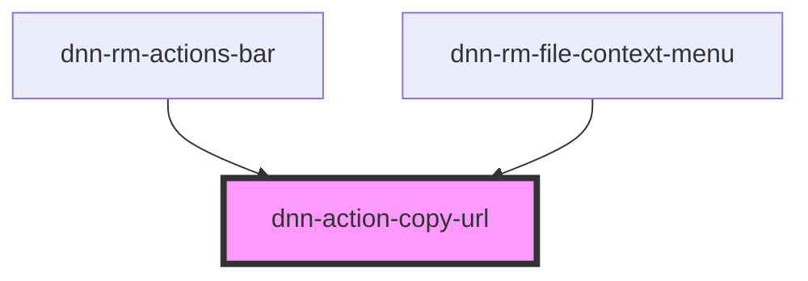

# dnn-action-move-items

<!-- Auto Generated Below -->

## Properties

| Property             | Attribute | Description                | Type     | Default     |
| -------------------- | --------- | -------------------------- | -------- | ----------- |
| `items` _(required)_ | `items`   | The list of items to copy. | `Item[]` | `undefined` |

## Dependencies

### Used by

 - [dnn-rm-actions-bar](../../dnn-rm-actions-bar)
 - [dnn-rm-file-context-menu](../../context-menus/dnn-rm-file-context-menu)

### Graph

----------------------------------------------

*Built with [StencilJS](https://stenciljs.com/)*
