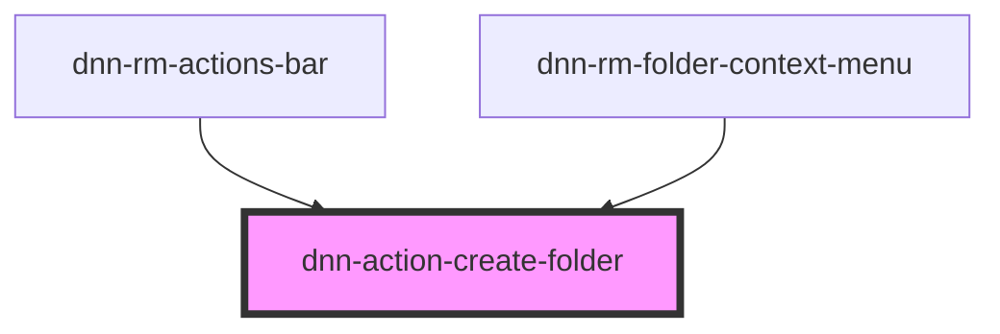

# dnn-action-create-folder

<!-- Auto Generated Below -->

## Properties

| Property                      | Attribute          | Description                                                    | Type     | Default     |
| ----------------------------- | ------------------ | -------------------------------------------------------------- | -------- | ----------- |
| `parentFolderId` _(required)_ | `parent-folder-id` | The ID of the parent folder into which to create a new folder. | `number` | `undefined` |

## Dependencies

### Used by

 - [dnn-rm-actions-bar](../../dnn-rm-actions-bar)
 - [dnn-rm-folder-context-menu](../../context-menus/dnn-rm-folder-context-menu)

### Graph

----------------------------------------------

*Built with [StencilJS](https://stenciljs.com/)*
