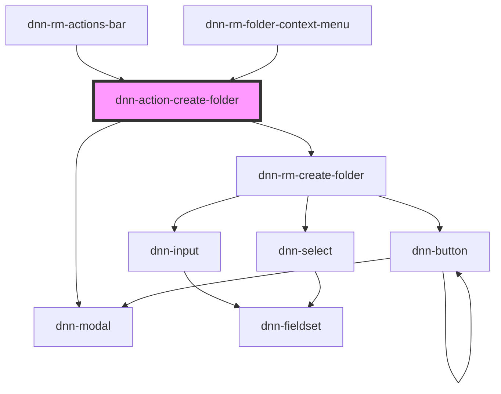

# dnn-action-create-folder

<!-- Auto Generated Below -->

## Properties

| Property         | Attribute          | Description | Type     | Default     |
| ---------------- | ------------------ | ----------- | -------- | ----------- |
| `parentFolderId` | `parent-folder-id` |             | `number` | `undefined` |

## Dependencies

### Used by

- [dnn-rm-actions-bar](../../dnn-rm-actions-bar)
- [dnn-rm-folder-context-menu](../../context-menus/dnn-rm-folder-context-menu)

### Depends on

- dnn-modal
- [dnn-rm-create-folder](../../dnn-rm-create-folder)

### Graph

---

_Built with [StencilJS](https://stenciljs.com/)_
