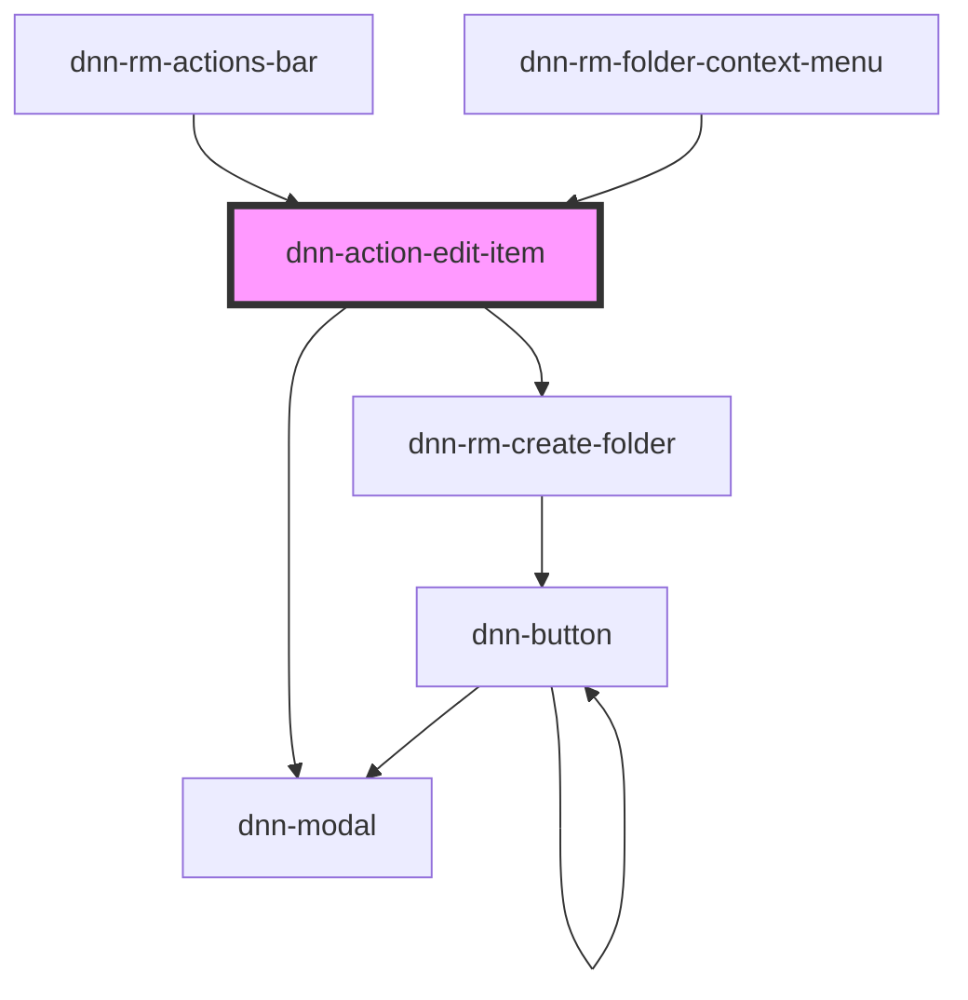

# dnn-action-edit-item

<!-- Auto Generated Below -->

## Properties

| Property            | Attribute | Description | Type   | Default     |
| ------------------- | --------- | ----------- | ------ | ----------- |
| `item` _(required)_ | --        |             | `Item` | `undefined` |

## Dependencies

### Used by

 - [dnn-rm-actions-bar](../../dnn-rm-actions-bar)
 - [dnn-rm-folder-context-menu](../../context-menus/dnn-rm-folder-context-menu)

### Depends on

- dnn-modal
- [dnn-rm-create-folder](../../dnn-rm-create-folder)

### Graph

----------------------------------------------

*Built with [StencilJS](https://stenciljs.com/)*
