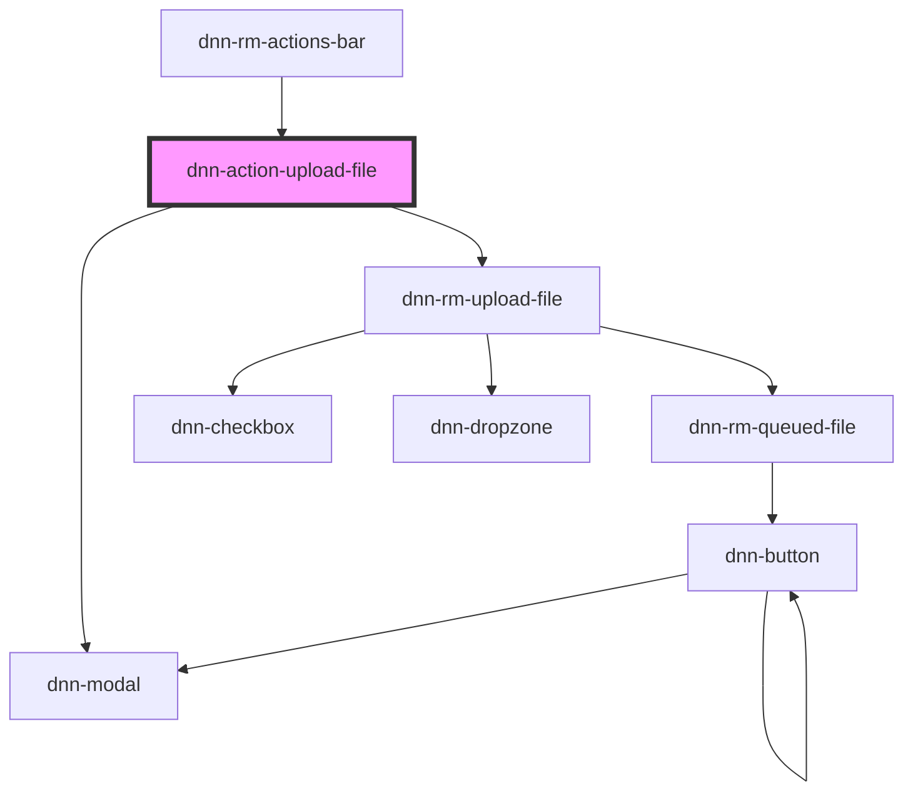

# dnn-action-upload-file

<!-- Auto Generated Below -->

## Properties

| Property         | Attribute          | Description                  | Type     | Default     |
| ---------------- | ------------------ | ---------------------------- | -------- | ----------- |
| `parentFolderId` | `parent-folder-id` | The ID of the parent folder. | `number` | `undefined` |

## Events

| Event                 | Description                                                                                                        | Type                |
| --------------------- | ------------------------------------------------------------------------------------------------------------------ | ------------------- |
| `dnnRmFoldersChanged` | Fires when there is a possibility that some folders have changed. Can be used to force parts of the UI to refresh. | `CustomEvent<void>` |

## Dependencies

### Used by

 - [dnn-rm-actions-bar](../../dnn-rm-actions-bar)

### Depends on

- dnn-modal
- [dnn-rm-upload-file](../../dnn-rm-upload-file)

### Graph

----------------------------------------------

*Built with [StencilJS](https://stenciljs.com/)*
