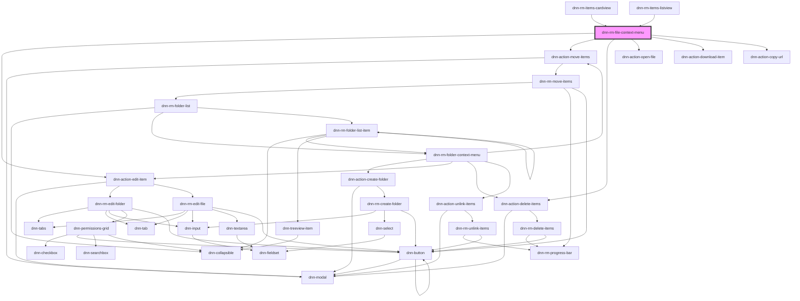

# dnn-rm-file-context-menu

<!-- Auto Generated Below -->

## Properties

| Property            | Attribute | Description                        | Type   | Default     |
| ------------------- | --------- | ---------------------------------- | ------ | ----------- |
| `item` _(required)_ | `item`    | The item that triggered this menu. | `Item` | `undefined` |

## Dependencies

### Used by

 - [dnn-rm-items-cardview](../../dnn-rm-items-cardview)
 - [dnn-rm-items-listview](../../dnn-rm-items-listview)

### Depends on

- [dnn-action-edit-item](../../actions/dnn-action-edit-item)
- [dnn-action-move-items](../../actions/dnn-action-move-items)
- [dnn-action-delete-items](../../actions/dnn-action-delete-items)
- [dnn-action-open-file](../../actions/dnn-action-open-file)
- [dnn-action-download-item](../../actions/dnn-action-download-item)
- [dnn-action-copy-url](../../actions/dnn-action-copy-url)

### Graph

----------------------------------------------

*Built with [StencilJS](https://stenciljs.com/)*
