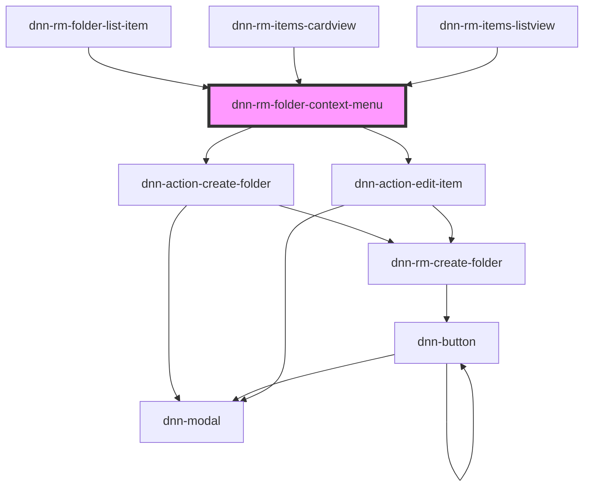

# dnn-rm-folder-context-menu

<!-- Auto Generated Below -->

## Properties

| Property                       | Attribute           | Description                                                        | Type     | Default     |
| ------------------------------ | ------------------- | ------------------------------------------------------------------ | -------- | ----------- |
| `clickedFolderId` _(required)_ | `clicked-folder-id` | The ID of the folder onto which the context menu was triggered on. | `number` | `undefined` |
| `clickedItem`                  | --                  |                                                                    | `Item`   | `undefined` |

## Dependencies

### Used by

 - [dnn-rm-folder-list-item](../../dnn-rm-folder-list-item)
 - [dnn-rm-items-cardview](../../dnn-rm-items-cardview)
 - [dnn-rm-items-listview](../../dnn-rm-items-listview)

### Depends on

- [dnn-action-create-folder](../../actions/dnn-action-create-folder)
- [dnn-action-edit-item](../../actions/dnn-action-edit-item)

### Graph

----------------------------------------------

*Built with [StencilJS](https://stenciljs.com/)*
