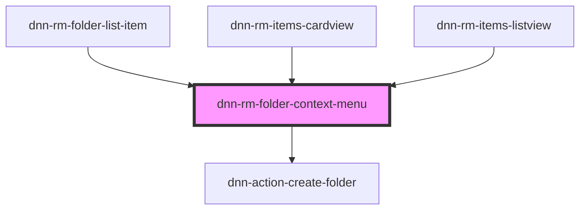

# dnn-rm-folder-context-menu

<!-- Auto Generated Below -->

## Properties

| Property                | Attribute   | Description | Type     | Default     |
| ----------------------- | ----------- | ----------- | -------- | ----------- |
| `folderId` _(required)_ | `folder-id` |             | `number` | `undefined` |

## Dependencies

### Used by

 - [dnn-rm-folder-list-item](../../dnn-rm-folder-list-item)
 - [dnn-rm-items-cardview](../../dnn-rm-items-cardview)
 - [dnn-rm-items-listview](../../dnn-rm-items-listview)

### Depends on

- [dnn-action-create-folder](../../actions/dnn-action-create-folder)

### Graph

----------------------------------------------

*Built with [StencilJS](https://stenciljs.com/)*
