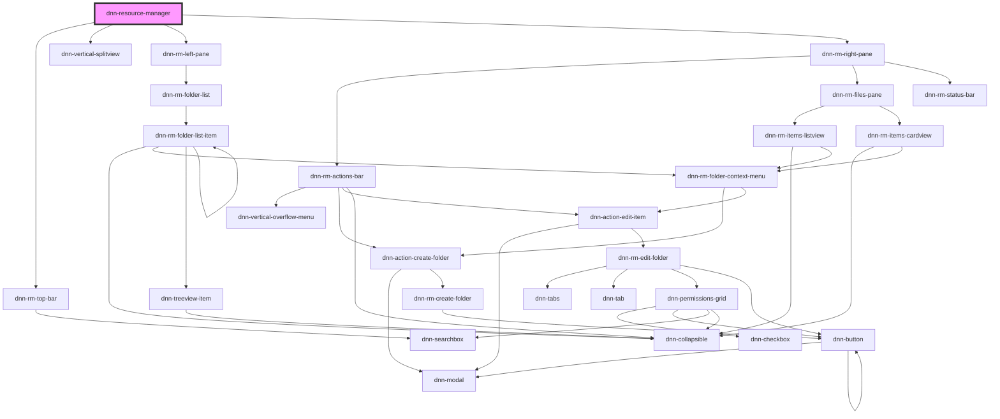

# dnn-resource-manager

<!-- Auto Generated Below -->

## Properties

| Property                | Attribute   | Description           | Type     | Default     |
| ----------------------- | ----------- | --------------------- | -------- | ----------- |
| `moduleId` _(required)_ | `module-id` | The ID of the module. | `number` | `undefined` |

## Dependencies

### Depends on

- [dnn-rm-top-bar](../dnn-rm-top-bar)
- dnn-vertical-splitview
- [dnn-rm-left-pane](../dnn-rm-left-pane)
- [dnn-rm-right-pane](../dnn-rm-right-pane)

### Graph

----------------------------------------------

*Built with [StencilJS](https://stenciljs.com/)*
