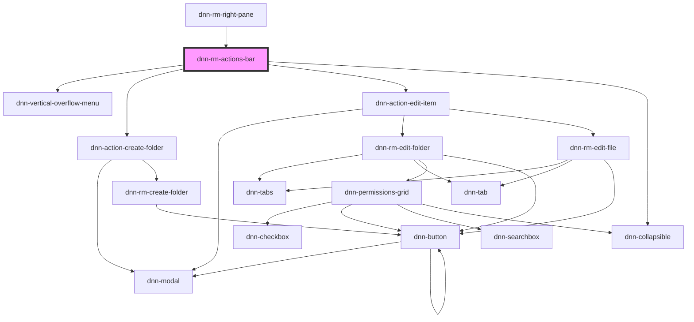

# dnn-rm-actions-bar

<!-- Auto Generated Below -->

## Dependencies

### Used by

 - [dnn-rm-right-pane](../dnn-rm-right-pane)

### Depends on

- dnn-vertical-overflow-menu
- [dnn-action-create-folder](../actions/dnn-action-create-folder)
- [dnn-action-edit-item](../actions/dnn-action-edit-item)
- dnn-collapsible

### Graph

----------------------------------------------

*Built with [StencilJS](https://stenciljs.com/)*
