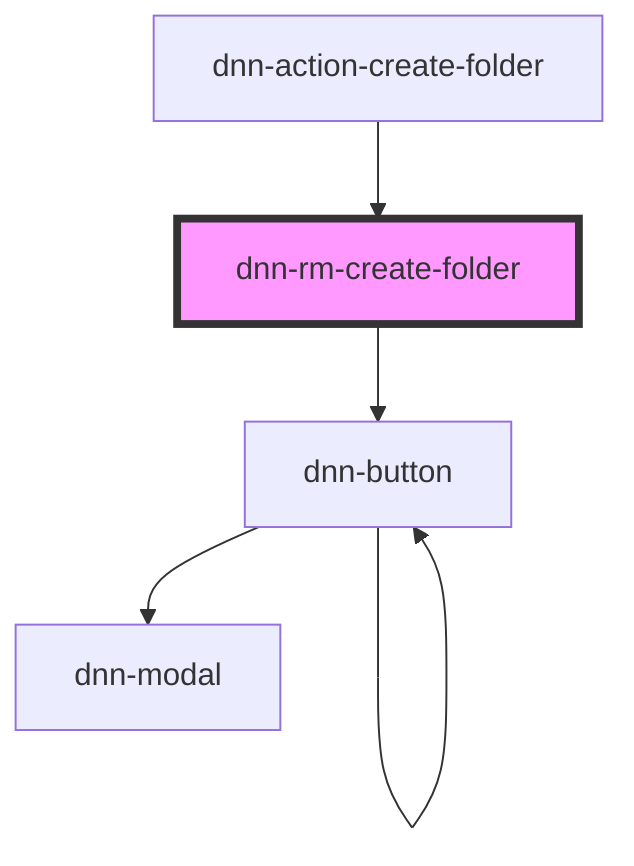

# dnn-rm-edit-folder

<!-- Auto Generated Below -->

## Events

| Event                 | Description                                                                                                        | Type                |
| --------------------- | ------------------------------------------------------------------------------------------------------------------ | ------------------- |
| `dnnRmFoldersChanged` | Fires when there is a possibility that some folders have changed. Can be used to force parts of the UI to refresh. | `CustomEvent<void>` |

## Dependencies

### Used by

 - [dnn-action-create-folder](../actions/dnn-action-create-folder)

### Depends on

- dnn-button

### Graph

----------------------------------------------

*Built with [StencilJS](https://stenciljs.com/)*
