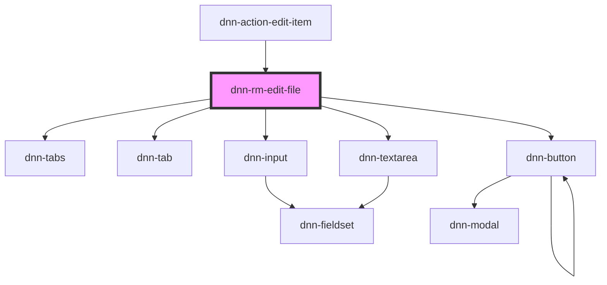

# dnn-rm-edit-file

<!-- Auto Generated Below -->

## Properties

| Property              | Attribute | Description                   | Type     | Default     |
| --------------------- | --------- | ----------------------------- | -------- | ----------- |
| `fileId` _(required)_ | `file-id` | The ID of the folder to edit. | `number` | `undefined` |

## Events

| Event                 | Description                                                                                                        | Type                |
| --------------------- | ------------------------------------------------------------------------------------------------------------------ | ------------------- |
| `dnnRmFoldersChanged` | Fires when there is a possibility that some folders have changed. Can be used to force parts of the UI to refresh. | `CustomEvent<void>` |

## Dependencies

### Used by

- [dnn-action-edit-item](../actions/dnn-action-edit-item)

### Depends on

- dnn-tabs
- dnn-tab
- dnn-input
- dnn-textarea
- dnn-button

### Graph

---

_Built with [StencilJS](https://stenciljs.com/)_
