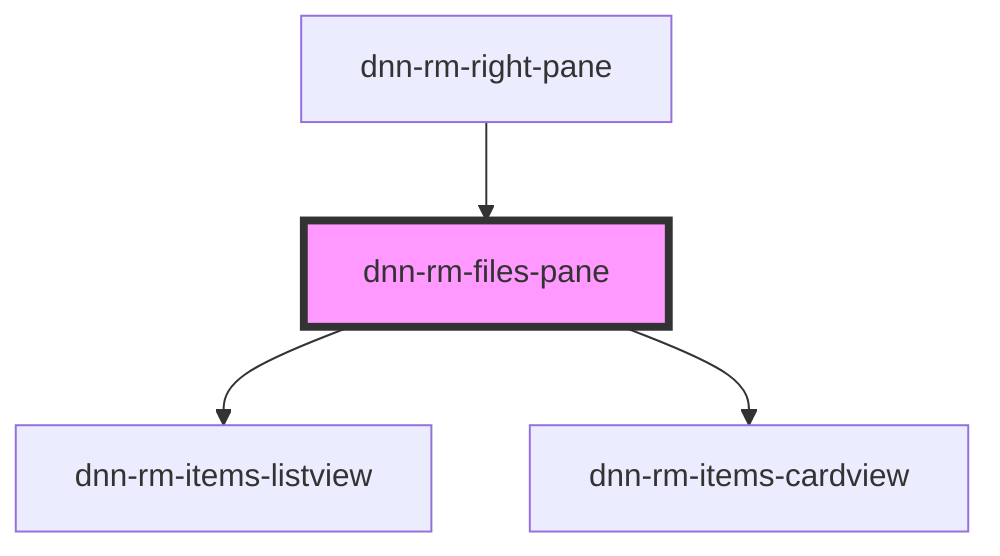

# dnn-rm-files-pane

<!-- Auto Generated Below -->

## Properties

| Property        | Attribute        | Description                                          | Type     | Default |
| --------------- | ---------------- | ---------------------------------------------------- | -------- | ------- |
| `preloadOffset` | `preload-offset` | Defines how much more pixels to load under the fold. | `number` | `5000`  |

## Dependencies

### Used by

 - [dnn-rm-right-pane](../dnn-rm-right-pane)

### Depends on

- [dnn-rm-items-listview](../dnn-rm-items-listview)
- [dnn-rm-items-cardview](../dnn-rm-items-cardview)

### Graph

----------------------------------------------

*Built with [StencilJS](https://stenciljs.com/)*
