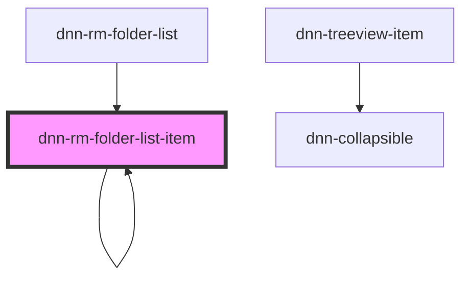

# dnn-rm-folder-list-item

<!-- Auto Generated Below -->

## Properties

| Property              | Attribute  | Description                                  | Type             | Default     |
| --------------------- | ---------- | -------------------------------------------- | ---------------- | ----------- |
| `expanded`            | `expanded` | If true, this node will be expanded on load. | `boolean`        | `false`     |
| `folder` _(required)_ | --         | The basic information about the folder       | `FolderTreeItem` | `undefined` |

## Dependencies

### Used by

 - [dnn-rm-folder-list](../dnn-rm-folder-list)
 - [dnn-rm-folder-list-item](.)

### Depends on

- dnn-treeview-item
- [dnn-rm-folder-list-item](.)

### Graph

----------------------------------------------

*Built with [StencilJS](https://stenciljs.com/)*
