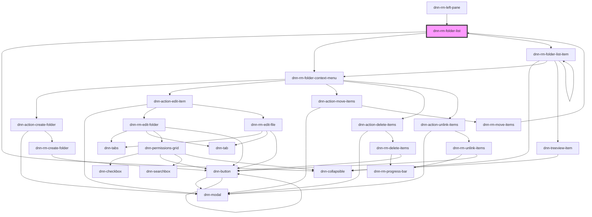

# dnn-rm-folder-list

<!-- Auto Generated Below -->

## Events

| Event                         | Description                                                             | Type                          |
| ----------------------------- | ----------------------------------------------------------------------- | ----------------------------- |
| `dnnRmcontextMenuOpened`      | Fires when a context menu is opened for this item. Emits the folder ID. | `CustomEvent<number>`         |
| `dnnRmFolderListFolderPicked` | Fires when a folder is picked.                                          | `CustomEvent<FolderTreeItem>` |

## Dependencies

### Used by

 - [dnn-rm-left-pane](../dnn-rm-left-pane)
 - [dnn-rm-move-items](../dnn-rm-move-items)

### Depends on

- dnn-collapsible
- [dnn-rm-folder-context-menu](../context-menus/dnn-rm-folder-context-menu)
- [dnn-rm-folder-list-item](../dnn-rm-folder-list-item)

### Graph

----------------------------------------------

*Built with [StencilJS](https://stenciljs.com/)*
