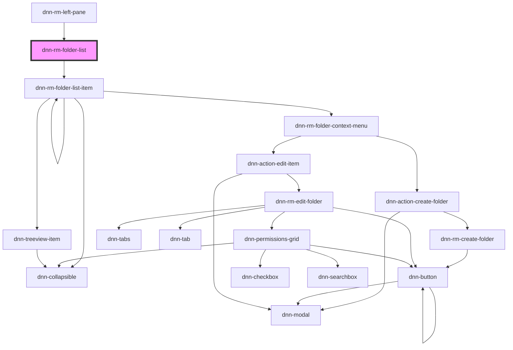

# dnn-rm-folder-list

<!-- Auto Generated Below -->

## Dependencies

### Used by

 - [dnn-rm-left-pane](../dnn-rm-left-pane)

### Depends on

- [dnn-rm-folder-list-item](../dnn-rm-folder-list-item)

### Graph

----------------------------------------------

*Built with [StencilJS](https://stenciljs.com/)*
