# dnn-rm-items-listview

<!-- Auto Generated Below -->

## Properties

| Property                    | Attribute       | Description                | Type                       | Default     |
| --------------------------- | --------------- | -------------------------- | -------------------------- | ----------- |
| `currentItems` _(required)_ | `current-items` | The list of current items. | `GetFolderContentResponse` | `undefined` |

## Events

| Event                      | Description                                                                         | Type                  |
| -------------------------- | ----------------------------------------------------------------------------------- | --------------------- |
| `dnnRmFileDoubleClicked`   | Fires when a file is double-clicked and emits the file ID into the event.detail     | `CustomEvent<string>` |
| `dnnRmFolderDoubleClicked` | Fires when a folder is double-clicked and emits the folder ID into the event.detail | `CustomEvent<number>` |

## Dependencies

### Used by

 - [dnn-rm-files-pane](../dnn-rm-files-pane)

### Depends on

- [dnn-rm-folder-context-menu](../context-menus/dnn-rm-folder-context-menu)
- [dnn-rm-file-context-menu](../context-menus/dnn-rm-file-context-menu)
- dnn-collapsible

### Graph

```mermaid
graph TD;
  dnn-rm-items-listview --> dnn-rm-folder-context-menu
  dnn-rm-items-listview --> dnn-rm-file-context-menu
  dnn-rm-items-listview --> dnn-collapsible
  dnn-rm-folder-context-menu --> dnn-action-create-folder
  dnn-rm-folder-context-menu --> dnn-action-edit-item
  dnn-rm-folder-context-menu --> dnn-action-move-items
  dnn-rm-folder-context-menu --> dnn-action-delete-items
  dnn-rm-folder-context-menu --> dnn-action-unlink-items
  dnn-action-create-folder --> dnn-modal
  dnn-action-create-folder --> dnn-rm-create-folder
  dnn-rm-create-folder --> dnn-input
  dnn-rm-create-folder --> dnn-select
  dnn-rm-create-folder --> dnn-button
  dnn-input --> dnn-fieldset
  dnn-select --> dnn-fieldset
  dnn-button --> dnn-modal
  dnn-button --> dnn-button
  dnn-action-edit-item --> dnn-modal
  dnn-action-edit-item --> dnn-rm-edit-folder
  dnn-action-edit-item --> dnn-rm-edit-file
  dnn-rm-edit-folder --> dnn-tabs
  dnn-rm-edit-folder --> dnn-tab
  dnn-rm-edit-folder --> dnn-input
  dnn-rm-edit-folder --> dnn-permissions-grid
  dnn-rm-edit-folder --> dnn-button
  dnn-permissions-grid --> dnn-checkbox
  dnn-permissions-grid --> dnn-button
  dnn-permissions-grid --> dnn-searchbox
  dnn-permissions-grid --> dnn-collapsible
  dnn-rm-edit-file --> dnn-tabs
  dnn-rm-edit-file --> dnn-tab
  dnn-rm-edit-file --> dnn-input
  dnn-rm-edit-file --> dnn-textarea
  dnn-rm-edit-file --> dnn-button
  dnn-textarea --> dnn-fieldset
  dnn-action-move-items --> dnn-modal
  dnn-action-move-items --> dnn-rm-move-items
  dnn-rm-move-items --> dnn-rm-folder-list
  dnn-rm-move-items --> dnn-rm-progress-bar
  dnn-rm-move-items --> dnn-button
  dnn-rm-folder-list --> dnn-collapsible
  dnn-rm-folder-list --> dnn-rm-folder-context-menu
  dnn-rm-folder-list --> dnn-rm-folder-list-item
  dnn-rm-folder-list-item --> dnn-collapsible
  dnn-rm-folder-list-item --> dnn-rm-folder-context-menu
  dnn-rm-folder-list-item --> dnn-treeview-item
  dnn-rm-folder-list-item --> dnn-rm-folder-list-item
  dnn-treeview-item --> dnn-collapsible
  dnn-action-delete-items --> dnn-modal
  dnn-action-delete-items --> dnn-rm-delete-items
  dnn-rm-delete-items --> dnn-rm-progress-bar
  dnn-rm-delete-items --> dnn-button
  dnn-action-unlink-items --> dnn-modal
  dnn-action-unlink-items --> dnn-rm-unlink-items
  dnn-rm-unlink-items --> dnn-rm-progress-bar
  dnn-rm-unlink-items --> dnn-button
  dnn-rm-file-context-menu --> dnn-action-edit-item
  dnn-rm-file-context-menu --> dnn-action-move-items
  dnn-rm-file-context-menu --> dnn-action-delete-items
  dnn-rm-file-context-menu --> dnn-action-open-file
  dnn-rm-file-context-menu --> dnn-action-download-item
  dnn-rm-file-context-menu --> dnn-action-copy-url
  dnn-rm-files-pane --> dnn-rm-items-listview
  style dnn-rm-items-listview fill:#f9f,stroke:#333,stroke-width:4px
```

----------------------------------------------

*Built with [StencilJS](https://stenciljs.com/)*
