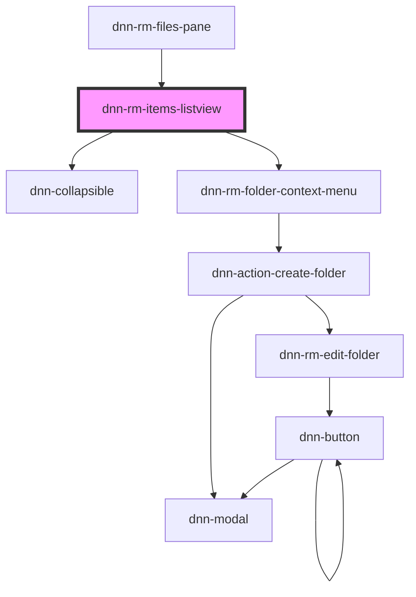

# dnn-rm-items-listview

<!-- Auto Generated Below -->

## Properties

| Property                    | Attribute | Description                | Type                       | Default     |
| --------------------------- | --------- | -------------------------- | -------------------------- | ----------- |
| `currentItems` _(required)_ | --        | The list of current items. | `GetFolderContentResponse` | `undefined` |

## Dependencies

### Used by

 - [dnn-rm-files-pane](../dnn-rm-files-pane)

### Depends on

- dnn-collapsible
- [dnn-rm-folder-context-menu](../context-menus/dnn-rm-folder-context-menu)

### Graph

----------------------------------------------

*Built with [StencilJS](https://stenciljs.com/)*
