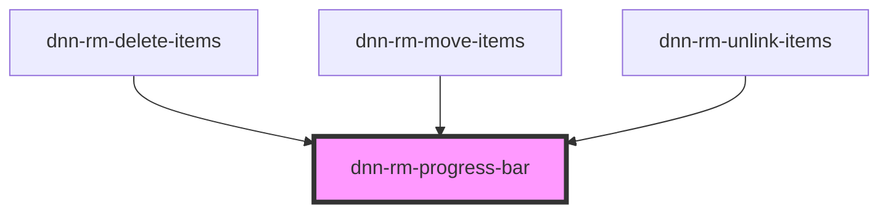

# dnn-rm-progress-bar

<!-- Auto Generated Below -->

## Properties

| Property | Attribute | Description                         | Type     | Default |
| -------- | --------- | ----------------------------------- | -------- | ------- |
| `max`    | `max`     | Defines the max progress value.     | `number` | `100`   |
| `value`  | `value`   | Defines the current progress value. | `number` | `0`     |

## CSS Custom Properties

| Name                    | Description                                    |
| ----------------------- | ---------------------------------------------- |
| `--progress-background` | Sets the background color of the progress bar. |
| `--progress-color`      | Sets the color of the progress bar.            |
| `--progress-height`     | Sets the height of the progress bar.           |

## Dependencies

### Used by

- [dnn-rm-delete-items](../dnn-rm-delete-items)
- [dnn-rm-move-items](../dnn-rm-move-items)
- [dnn-rm-unlink-items](../dnn-rm-unlink-items)

### Graph

---

_Built with [StencilJS](https://stenciljs.com/)_
