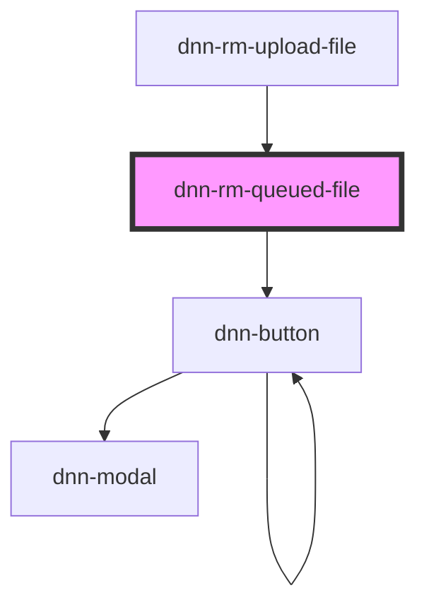

# dnn-rm-queued-file

<!-- Auto Generated Below -->

## Properties

| Property                         | Attribute              | Description                                           | Type      | Default     |
| -------------------------------- | ---------------------- | ----------------------------------------------------- | --------- | ----------- |
| `extract`                        | `extract`              | Whether to extract uploaded zip files.                | `boolean` | `false`     |
| `file` _(required)_              | --                     | The file to upload.                                   | `File`    | `undefined` |
| `filter` _(required)_            | `filter`               | Optionally limit the file types that can be uploaded. | `string`  | `undefined` |
| `maxUploadFileSize` _(required)_ | `max-upload-file-size` | The maximal allowed file upload size                  | `number`  | `undefined` |
| `validationCode` _(required)_    | `validation-code`      | The validation code to use for uploads.               | `string`  | `undefined` |

## Dependencies

### Used by

- [dnn-rm-upload-file](../dnn-rm-upload-file)

### Depends on

- dnn-button

### Graph

---

_Built with [StencilJS](https://stenciljs.com/)_
