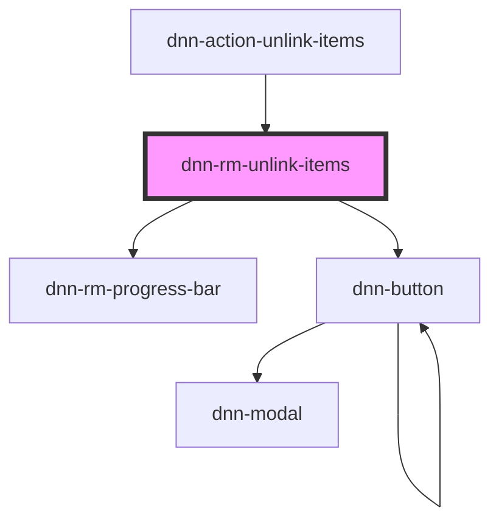

# dnn-rm-edit-file

<!-- Auto Generated Below -->

## Properties

| Property             | Attribute | Description                  | Type     | Default     |
| -------------------- | --------- | ---------------------------- | -------- | ----------- |
| `items` _(required)_ | --        | The list of items to delete. | `Item[]` | `undefined` |

## Events

| Event                 | Description                                                                                                        | Type                |
| --------------------- | ------------------------------------------------------------------------------------------------------------------ | ------------------- |
| `dnnRmFoldersChanged` | Fires when there is a possibility that some folders have changed. Can be used to force parts of the UI to refresh. | `CustomEvent<void>` |

## Dependencies

### Used by

- [dnn-action-unlink-items](../actions/dnn-action-unlink-items)

### Depends on

- [dnn-rm-progress-bar](../dnn-rm-progress-bar)
- dnn-button

### Graph

---

_Built with [StencilJS](https://stenciljs.com/)_
