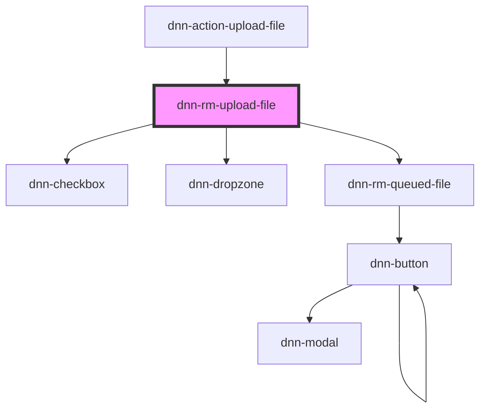

# dnn-rm-upload-file

<!-- Auto Generated Below -->

## Events

| Event                 | Description                                                                                                        | Type                |
| --------------------- | ------------------------------------------------------------------------------------------------------------------ | ------------------- |
| `dnnRmFoldersChanged` | Fires when there is a possibility that some folders have changed. Can be used to force parts of the UI to refresh. | `CustomEvent<void>` |

## Dependencies

### Used by

- [dnn-action-upload-file](../actions/dnn-action-upload-file)

### Depends on

- dnn-checkbox
- dnn-dropzone
- [dnn-rm-queued-file](../dnn-rm-queued-file)

### Graph

---

_Built with [StencilJS](https://stenciljs.com/)_
