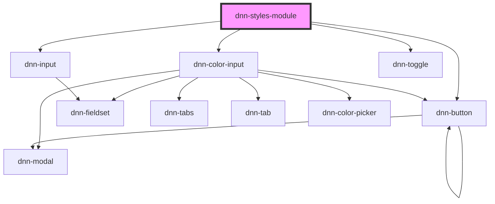

# dnn-styles-module

<!-- Auto Generated Below -->

## Dependencies

### Depends on

- dnn-color-input
- dnn-input
- dnn-toggle
- dnn-button

### Graph

----------------------------------------------

*Built with [StencilJS](https://stenciljs.com/)*
