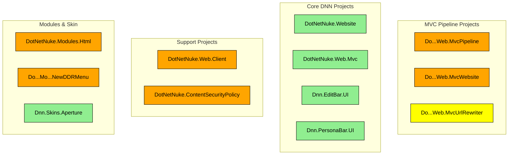

# List of Pull requests - sujested merge order

## on feature/mvc-pipeline-old branch
> PR are inter dependend

> first merge this PRs without review

> before reviewing "First code submission for MVC Pipeline", so everthing will be rewiewed in this PR

* MVC pipeline - Module control — Type: Feature [#6700](https://github.com/dnnsoftware/Dnn.Platform/pull/6700)
* MVC pipeline popups [#6723](https://github.com/dnnsoftware/Dnn.Platform/pull/6723) 
* MVC pipeline (routing / settings) [#6721](https://github.com/dnnsoftware/Dnn.Platform/pull/6721)
* MVC pipeline - module actions [#6725](https://github.com/dnnsoftware/Dnn.Platform/pull/6725) 

## on feature/mvc-pipeline branch
* First code submission for MVC Pipeline [#6749](https://github.com/dnnsoftware/Dnn.Platform/pull/6749)

## on develop branch

* Replace CDF [#6729](https://github.com/dnnsoftware/Dnn.Platform/pull/6729)
* Content security policy headers (CSP) [#6752](https://github.com/dnnsoftware/Dnn.Platform/pull/6752)
* Priority-based IPageService for page metadata, head tags, and messages [#6738](https://github.com/dnnsoftware/Dnn.Platform/pull/6738) 

> after merge, mvc code need to be adapted to use it

# List of modified projects - sujested order of review

### Projects graph

### Legend
- 🟢 **Green**: Stable projects (no major changes planned)
- 🟠 **Orange**: Projects that will change (PR or planned development)
- 🟡 **Yellow**: Tempory projects (will be removed)

## MVC Pipeline Projects

### DotNetNuke.Web.MvcPipeline

> The main project that provides the MVC rendering pipeline for DNN.

#### Project Structure:
- **Controllers**: MVC controllers for page rendering and module actions (some settings stuff are not used, actually out of scope )
- **Models**: View models for pages, skins, containers, and modules
- **Framework**: Core framework components (factories, services, JavaScript libraries)
- **Skins**: Skin helpers and utilities for MVC pipeline
- **Containers**: Container helpers and utilities
- **ModuleControl**: Base classes for MVC module controls
- **Modules**: Module-specific helpers and utilities
- **Security**: Security models and controllers for permissions grid (actually not used, because module settings is actually out of scope)
- **Routing**: MVC routing components and route management
- **UI**: UI utilities and client-side components
- **Extensions**: Extension methods for startup and configuration
- **Exceptions**: Custom exception classes for MVC pipeline
- **Commons**: Common utilities and shared components

#### Dependencies:
- DotNetNuke.ContentSecurityPolicy
- DotNetNuke.HttpModules  
- DotNetNuke.Library
- ClientDependency.Core.Mvc

#### Used By:
- DotNetNuke.Web.MvcWebsite
- DotNetNuke.Website
- DotNetNuke.Modules.Html
- Skins and modules (via runtime references)

### DotNetNuke.Web.MvcWebsite
  * created to avoid circular dependencies
  * this can maybe moved to DotNetNuke.Website
  * DefaultController : entry point, replacement for default.aspx
  
### DotNetNuke.Web.MvcUrlRewriter
> will change
* will be removed, the code will move to DotNetNuke.Web.UrlRewriter [#6721](https://github.com/dnnsoftware/Dnn.Platform/pull/6721)
  
## Modules & Skin

### DotNetNuke.Modules.Html
> will change
* contain addional MVC controls to support the mvc pipeline
* will change a lot in [#6700](https://github.com/dnnsoftware/Dnn.Platform/pull/6700)

### Dnn.Skins.Aperture
* support for the MVC pipeline is added

### Dotnetnuke.Modules.NewDDRMenu
> will change - no PR yet
* this is the base of a new Menu that is 100% razor based and is compatible with the 2 pipeline [project issue](https://github.com/orgs/dnnsoftware/projects/5/views/5?pane=issue&itemId=126763185)

## Core DNN Projects

### Dotnetnuke.Website

> web.config in Portals modifications ???
* Views : core razor layout and views
* mvc.js : some small stuff for making the mvc pipeline compatible with existing js stuff

## Dotnetnuke.Web.Mvc
* make actual MVC modules compatible with MVC pipeline
* the MVC Controllers will be used as Child Controllers in the MvcPipeline
* to be compatible with the 2 pipeline it's required that they only use stuff that is undependent of the pipeline (new CDF, IPageService, ...)

## Dnn.EditBar.UI
* introduce MvcContentEditorManager : mvc variant of ContentEditorManager

## Dnn.PersonaBar.UI
* introduce PersonaBarContainerController and Model : for personabar rendering in mvc

## Support projects

### DotNetNuke.Web.Client
> class will be removed
* introduce : MvcClientResourceManager that will be replaced by new CDF [#6729](https://github.com/dnnsoftware/Dnn.Platform/pull/6729)

### DotNetNuke.ContentSecurityPolicy
> will change
* will be replaced by [#6752](https://github.com/dnnsoftware/Dnn.Platform/pull/6752)

## Refs
> will be removed
will be replaced by new CDF [#6729](https://github.com/dnnsoftware/Dnn.Platform/pull/6729)